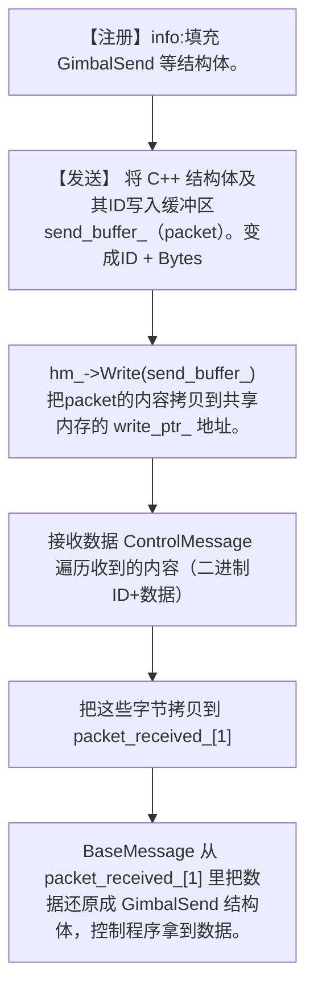

作为通信学院的学生，第二个模块就来看看通信吧（通信学院就是*诈骗*
# message模块
*阅读目标*
1. 理解各模块间是如何进行通信的
2. 视觉模块需要发送什么消息
3. 关于通信我们需要配置什么参数
视觉代码将计算出的目标角度填入 GimbalSend 结构体，调用 ControlMessage::WriteData(GimbalSend) 将数据序列化到缓冲区，然后调用 ControlMessage::Send() 一次性发送给主控。


题外话|硬件层面

    是进程调用 ControlMessage::Send()，CPU 执行指令，将代表目标角度的二进制数据块（通过 mmap 映射）写入到上位机内存条（RAM）的一个特定物理区域。（Shm::Lock() 调用信号量 (semop)，确保在写入完成前，控制进程无法读取，避免数据混乱。）
    通过USB-to-TTL 串口线连接上下位机。
    控制进程将共享内存中获取的结构化数据，重新封装成适用于串口通信的数据帧（通常包含帧头、ID、数据和校验位）。
    上位机的串口控制器将这些数字数据（0和1）转化为串行电信号：高电平代表 1，低电平代表 0，按照预设的波特率（如 115200 bps）依次发送。
    下位机（STM32）的 UART 接收引脚 监测到电平变化，触发中断。单片机的微控制器将这些电信号重新组合成完整的数字数据帧。
    下位机接收到目标角度指令后，需要将其转化为驱动电机的电流信号。
    下位机运行控制算法（如 PID），根据视觉的目标角度和电机当前角度的差值，计算出电机需要的扭矩（通常表现为 PWM 或电流值）。
    单片机的 CAN 控制器 将计算出的控制指令打包成 CAN 报文，并广播到 CAN 总线上。与电机集成的电子调速器（电调） 始终监听 CAN 总线。它识别出发送给它自身 ID 的报文。物理驱动： 电调根据报文内容，精确控制内部的功率元件（MOSFET）导通与截止，向电机线圈输送电流。最终动作： 电流产生的磁场驱动电机转子转动，云台开始运动，物理目标达成。

## info
定义了几个结构体，分别对应了视觉模块会接收&发送的数据
## message-base
### 设计目标
1. 如何在不修改主控逻辑的情况下，支持串口、网络或模拟通信
2. 如何确保发送和接收的数据结构在通信双方得到正确识别
3. 如何用统一的接口处理不同类型的 C++ 数据
4. 如何在运行时动态创建不同类型的通信实例
### 具体实现
运用了很多虚函数和模板类啊。那么他们的作用是什么呢？
+ 虚函数：可以灵活切换串口或网络通信（根据传入的参数，对症下药选择对应的函数）
+ 模板类：确保数据在任何通信协议下都能保证类型安全。
以以下代码举例：
```cpp
  template <typename T>//模板函数声明，编译时，编译器会根据传入的实际类型自动生成一个特定版本的函数。
  bool ReceiveRegister(short id);//函数签名，返回bool型结果，传入short型参数
  /**
   * @brief 为发送数据包分配编号
   * @tparam T 数据包类型
   * @param id 分配的编号
   * @return 是否分配成功
   */
   ```
+ Registry定义
```cpp
using Registry = std::unordered_map<std::string, std::pair<short, short>>; 
//哈希表unordered_map，提供了平均 $O(1)$ 时间复杂度的查找、插入和删除操作。
//核心的类型名（string）与ID和size绑定。ID和size的唯一性
```
核心的注册逻辑，将一个数据类型 T 永久地映射到一个唯一的短 ID (id)。
+ ReceiveRegister
接收消息
+ enable_factory
## packet
### 设计目标
实现 C++ 对象和原始字节流之间的序列化 (Write) 和反序列化 (Read)，作为通信缓冲区的载体。
### 具体实现
+ write
将一个数据结构或对象转换为可以存储（如写入文件）或传输（如通过网络或串口发送）的连续字节流的过程。（char格式）
+ read
将接收到的字节流（或从存储介质读取的字节数组）还原为原始的、有意义的、内存中的数据结构或对象的过程。
从 Packet 缓冲区中取出固定数量的字节，并复制到目标对象 data 的内存地址，从而重建 data 对象。
+ 私有继承：
继承std::vector（动态数组能力），防止外部直接调用这些方法，确保所有操作都通过 Write/Read 这种受控的接口。（私有继承后Packet 内部可以访问 vector 的所有功能；Packet 外部（即使用 Packet 对象的代码）不能访问 vector 的任何公共函数）
## control
+ 智能指针
传统指针会存在忘记析构（特指在堆上，即用指针？创建的对象）而造成内存泄漏的问题。智能指针可以避免这一点，当对象被销毁时，智能指针会自动调用其管理的对象的析构函数，释放内存。
1. unique_ptr:
  同一时刻，只有一个 unique_ptr 可以指向堆上的对象。独占且不可复制。
  当 unique_ptr 对象离开作用域（例如函数返回、代码块结束）时，它会自动调用 delete 释放其管理的内存。
  当你需要一个对象在程序中只有一个拥有者，并且该对象生命周期与拥有者严格绑定时使用。
2. shared_ptr：
  共享。多个 shared_ptr 可以同时指向同一个对象。
  每复制一次，内部引用计数加一。每有一个 shared_ptr 被销毁或重置，引用计数减一。
  只有当最后一个 shared_ptr 被销毁，且引用计数降为零时，它才会自动调用 delete 释放内存。
3. weak_ptr：
  对资源进行弱引用，不会增加 shared_ptr 的引用计数。
  打破 shared_ptr 可能导致的循环引用问题，即两个对象互相持有对方的 shared_ptr 导致计数永远不为零，从而无法释放。
  在这种循环依赖中，将其中一个引用（通常是子节点指向父节点或反向的引用）改为使用 `std::weak_ptr`。由于 `weak_ptr` 不影响引用计数，循环就会被打破，对象可以在最后一个 `shared_ptr` 销毁时被正确释放。
  提供了一种访问由 `std::shared_ptr` 管理对象的方式，但**不拥有**该对象的所有权
```cpp
std::unique_ptr<Shm> shm_;
```