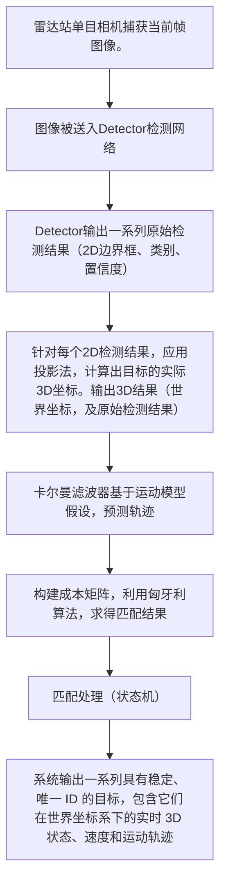

# 阅读报告
## 主要亮点
集中在detector和轨迹跟踪两方面
* 保留单目相机，提出全新投影方案（是什么？->射线投射
* 延续TDT的三层神经网络识别（车，装甲板，数字（resnet））；并把resnet替换成更轻量的MobileNet
* 最亮点：基于匈牙利匹配算法的匹配与跟踪系统：多目标匹配，在机器人快速移动，装甲板被遮挡导致无法识别的情况下，维持稳定的机器人身份识别，流畅的轨迹跟踪（如何做到？
## 大致流程

## 模块简述
主要涉及了两大模块：识别与追踪
### detector
1. 三层检测
    a. 识别车辆（PredictorWithTracker），为每个目标分配一个稳定且唯一的track_id（防止目标丢失），然后根据车辆边界框（2D）裁剪出ROI，装甲板、数字）；
    b. 对所有车辆ROI组成的批次图像进行检测，找到装甲板的精确位置，并识别装甲板数字及灯条颜色（twostep不会额外识别颜色），返回类别ID（B3）【装甲板&数字&颜色识别都被封装在armor_detector函数了】
2. 使用车辆边界框的底部中心点作为参考点，调用 pixel_to_world 转换器，计算出机器人在三维世界坐标系中的精确位置。
3. 将跟踪ID (bot_id)、3D 位置 (pos_3d)、车辆框、装甲板框、装甲板类别 ID 和置信度整合到 SingleDetectionResult 结构体中。
4. 开启可视化，则在图像上绘制车辆和装甲板的边界框、标签和 ID，用于调试和监控。输出包含所有检测信息的列表和可选的可视化图像。

（需使用solvepnp，结合6个3D-2D点对匹配关系（6个三维坐标已知且精确的关键点与手动标定这6个点对应的二维像素坐标）进行标定，实现相机与场地之间的精确空间对齐。并使用重投影验证

### tracking
面向固定数量，基于匹配机制的多目标追踪算法
1. 什么是成本矩阵——>量化现有轨迹和当前帧检测结果的不匹配程度<——基于匹配权重的各项指标计算相似度分数
2. 为什么匈牙利算法要最小化成本总和——>将高相似度转化为低成本（匈牙利算法是解决最小化问题的）以此找到最优解
~~感觉数据结构在殴打我~~
3. 状态机:
        a. INACTIVE（初始状态：跟踪器为此检测创建一个新的TrackingState对象）
        b. TENTATIVE 每次成功匹配，track.hit_count计数器加1。如果hit_count达到 HIT_COUNT_THRESHOLD，状态升级为CONFIRMED。（此时，轨迹被认为是稳定且可信的“现有轨迹”。）
        c. CONFIRMED 卡尔曼滤波器更新,使用新的检测结果校正轨迹的运动状态和边界框，消除噪声，并继续保持活跃。
        d. LOST miss_count计数器开始计时.卡尔曼滤波器预测,在下一帧，即使没有新的检测，滤波器也会基于运动模型预测轨迹，用于下一次匹配。
4. 猜点逻辑，用于目标长期丢失（超出LOST阈值）时，提供预测