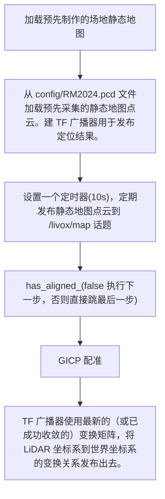
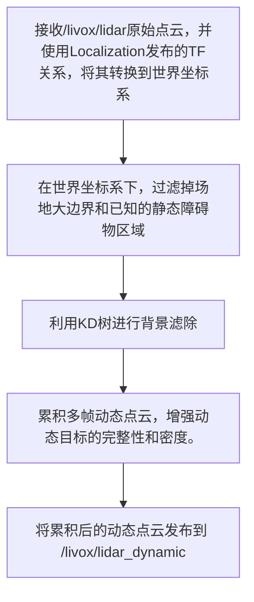
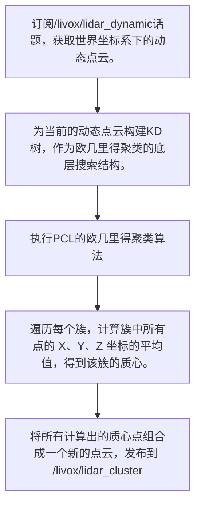

# TDT雷达模块理解
## what & why
雷达模块是雷达站上运行的算法系统，拥有固定的、较高的视角，可为战队提供全图的透视效果，获取实时、可靠的敌方机器人位置、身份和运动轨迹信息，从而辅助战术决策和精准打击。
在ROS2中，各个模块的通信方式？
## 架构图（硬件层-->感知层(雷达&相机)-->融合层-->决策层）
相机：
```mermaid
graph TD
    A["Livox驱动：采集点云"] --> B["Localization：加载预采集地图，GICP配准"]
    B --> C["dynamic_cloud：点云转世界坐标系，KdTree离群点检测等预处理，输出 livox/lidar_dynamic"]
    C --> D["cluster：对动态点云做欧几里得聚类，通过 livox/cluster 发布"]
    D --> I
    E["相机驱动：采集相机图像，发布 camera_image"]--> F["Calib：把图像检测坐标转换到世界/场地坐标系，保存 config/out_matrix.yaml"]
    F --> G["Detect：图像上做装甲&机器人&数字识别。检测结果发布为detect_result。"]
    G --> H["Resolve：把相机检测的像素坐标与外参、透视变换等结合，解算出目标在世界坐标系的位置,并发布resolve_result"]
    H --> I["Kalman_filter：结合雷达（实时3D坐标）和相机（目标ID、颜色、标签）的结果，预测目标下一时刻的位置，并修正当前的状态，从而消除传感器带来的瞬间抖动和噪声，输出一个更平稳、更可靠的轨迹。"]
    I --> L[决策层]

    J["debug_map：可视化点云、聚类、轨迹、相机识别结果"]
    K["usart：打包融合信息并下发主控 / 云台 / 装甲系统"]
    end

    classDef invisible fill=none,stroke=none;
```

## 实战流程
### lidar：实现了将动态点云转换为质心目标的聚类过程
#### 名词理解
+ 点云：它由激光雷达（LiDAR）传感器发射激光束，测量激光触及物体后返回的时间和角度，从而计算出每个点的三维坐标 $(x, y, z)$。每个点都代表传感器视野范围内物体表面的一个采样点。
+ 质心：提取质心是将复杂的点云数据简化和抽象，用一个单一的、稳定的点来代表目标的位置。（也方便后续的滤波）

~~看到这我其实有个问题：点云中应该包含了很多物体，如何区分不同物体，并分别提取出质心？由此引入了聚类↓~~
+ 聚类：将属于同一个物理物体的点云划分到一个数据组中。TDT采用的是欧几里得聚类（适用于形状规则且分离度高（有明显间距）的目标定位。且在赛场上物体数量动态变化，因此不适用需要预设目标数量的算法。
#### 大致流程
`localization`

`DynamicCloud`

`Cluster`

这个/livox/lidar_cluster话题上的质心数据，就代表了雷达站LiDAR模块最终输出的实时3D坐标，可以供上层决策和跟踪系统使用。

#### localization
+ 初始化与配置
模块启动时执行一次，用于准备地图和ROS接口。

    1. 读取 config/RM2024.pcd 文件，将其加载到内存中的 静态地图点云 (target_cloud_)。这是配准的目标（Target）
    2. 创建订阅器，接收来自 /livox/lidar 话题的原始点云数据。每当有新数据到达，就会触发 callback 函数。
    3. 创建两个发布器，用于发布地图 (/livox/map) 和过滤后的点云 (/filter_map)。
    4. 设置一个定时器（每 10 秒），定期将 target_cloud_ 发布到 /livox/map 话题。这主要用于 RViz 可视化，让操作员能看到地图的位置。
    5. 初始化 tf2_ros::TransformBroadcaster (tf_broadcaster_)，用于将最终的定位结果（变换矩阵）以 TF 坐标系变换的形式广播出去。


#### dynamic_cloud
+ 初始化与预处理
DynamicCloud节点的主要是接收原始LiDAR数据，通过坐标变换、过滤静态障碍物和进行背景减除，最终输出干净、累积的动态目标点云。

    1. 启动dynamic_cloud_node，初始化TF缓冲区和监听器（处理坐标变换）
    2. 从config/RM2024.pcd文件加载预先采集的静态地图点云。
    3. 对加载的地图进行体素滤波（大小为 0.1m），以减少点数并提高后续KD树搜索效率。
    4. 使用下采样后的地图点云构建KD树。实现背景减除。
    5. 设置ROS接口

#### Cluster
+ Cluster::Cluster()节点配置
此阶段在节点启动时只执行一次，完成ROS2节点的配置。

    1. 调用构造函数，节点启动
    2. 向ROS2系统注册，设置名称
    3. 创建订阅/livox/lidar_dynamic话题的接口，该话题接收上游DynamicCloud节点发布的动态点云
    4. 将Cluster::callback函数与该订阅通道绑定，准备接收数据
    5. 创建发布 /livox/lidar_cluster 话题的接口，准备向下游Fusion Module节点发布质心点云
    6. 节点进入 ROS2 事件循环，处于休眠状态，等待 /livox/lidar_dynamic 话题上的数据。

+ Cluster::callback 运行与数据处理
此阶段在每次收到新数据时自动触发。

    1. /livox/lidar_dynamic话题收到新的动态点云消息。
    2. Cluster::callback函数被ROS2自动执行。
    3. 函数内部执行PCL库的欧几里得聚类算法，将输入的点云数据分割成多个独立的簇。
    4. 遍历每个有效的点簇，计算其几何中心（质心）坐标。
    5. 将质心点云消息发布到/livox/lidar_cluster话题。
    6. 等待 /livox/lidar_dynamic 话题上的数据。
    7. 回调函数执行完毕，节点返回等待状态，继续监听下一个输入数据包。

### TDT_vision
tdt_vision 模块是一个多组件的 ROS 2 视觉感知系统，旨在从单目相机图像中实时提取、定位和跟踪场地内的机器人目标，并输出稳定的 3D 状态信息。
#### detect
精确识别出场上所有机器人的装甲板中心点、颜色和数字编号。

    1. 节点通过ROS2订阅camera_image话题，获取原始的相机图像数据（并转换成cv::Mat格式）。
    2. 使用yolo模型粗略识别车辆，筛选过后对图片做一些处理（裁剪）并储存在car_imgs列表
    3. 使用armor_yolo模型对所有车辆小图进行批量推理，精确识别车辆内部的装甲板。将检测到的坐标储存
    4. 遍历所有已检测到装甲板的车辆。根据装甲板的坐标，计算出每个装甲板在原始全图上的精确矩形框。（并裁剪，转换格式classify::Image）
    5. 调用classifier模型对所有装甲板小图进行批量推理
    6. 按照顺序，将分类结果（class_label）从批量结果中取出，并赋值给对应的装甲板结构体。
    7. 筛选最佳目标，遍历每辆车上的所有装甲板，找到max_confidence，且class_label != 0的最佳装甲板。
    8. 确定最佳装甲板的颜色（0/2）；计算中心坐标
    9. 将装甲板的中心坐标、颜色和数字信息写入 ROS 消息vision_interface::msg::DetectResult 中。（数据是按照 blue_x[N] 和 red_x[N] 的格式存储的，其中 N 是数字编号减一。）
    10. 通过 pub->publish(detect_result) 将结构化的检测结果发布出去。

#### resolve
实现RoboMaster雷达站软件架构中的核心定位和可视化功能。