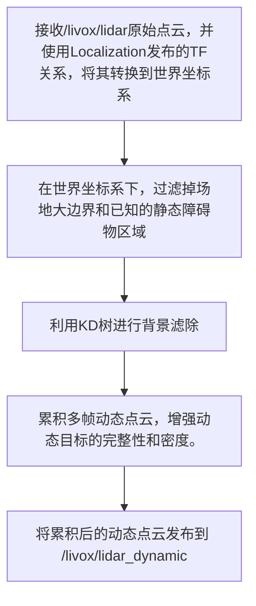
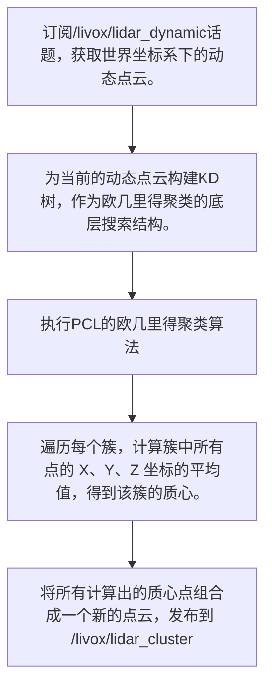

# TDT雷达模块理解
## what & why
雷达模块是雷达站上运行的算法系统，拥有固定的、较高的视角，可为战队提供全图的透视效果，获取实时、可靠的敌方机器人位置、身份和运动轨迹信息，从而辅助战术决策和精准打击 。
## 实战流程
由3个步骤组成：上游DynamicCloud；中游lidar；下游
### lidar：实现了将动态点云转换为质心目标的聚类过程
#### 名词理解
+ 点云：它由激光雷达（LiDAR）传感器发射激光束，测量激光触及物体后返回的时间和角度，从而计算出每个点的三维坐标 $(x, y, z)$。每个点都代表传感器视野范围内物体表面的一个采样点。
+ 质心：提取质心是将复杂的点云数据简化和抽象，用一个单一的、稳定的点来代表目标的位置。（也方便后续的滤波）

~~看到这我其实有个问题：点云中应该包含了很多物体，如何区分不同物体，并分别提取出质心？由此引入了聚类↓~~
+ 聚类：将属于同一个物理物体的点云划分到一个数据组中。TDT采用的是欧几里得聚类（适用于形状规则且分离度高（有明显间距）的目标定位。且在赛场上物体数量动态变化，因此不适用需要预设目标数量的算法。
#### 大致流程
`localization`
```mermaid
graph TD
    A[加载预先制作的场地静态地图] --> B[从config/RM2024.pcd文件加载预先采集的静态地图点云。建TF广播器用于发布定位结果。]
    B --> C[设置一个定时器(10s)，定期发布静态地图点云到/livox/map话题，用于RViz可视化。]
    C --> D{has_aligned_ }
    D -->|false| E[GICP配准]
    D -->|True| L[TF广播器使用最新的（或已成功收敛的）变换矩阵，将LiDAR坐标系到世界坐标系的变换关系发布出去。]
    E --> L
```
`DynamicCloud`

`Cluster`

这个/livox/lidar_cluster话题上的质心数据，就代表了雷达站LiDAR模块最终输出的实时机器人3D坐标，可以供上层决策和跟踪系统使用。

#### dynamic_cloud
+ 初始化与预处理
DynamicCloud节点的主要是接收原始LiDAR数据，通过坐标变换、过滤静态障碍物和进行背景减除，最终输出干净、累积的动态目标点云。

    1. 启动dynamic_cloud_node，初始化TF缓冲区和监听器（处理坐标变换）
    2. 从config/RM2024.pcd文件加载预先采集的静态地图点云。
    3. 对加载的地图进行体素滤波（大小为 0.1m），以减少点数并提高后续KD树搜索效率。
    4. 使用下采样后的地图点云构建KD树。实现背景减除。
    5. 设置ROS接口

#### Cluster
+ Cluster::Cluster()节点配置
此阶段在节点启动时只执行一次，完成ROS2节点的配置。

    1. 调用构造函数，节点启动
    2. 向ROS2系统注册，设置名称
    3. 创建订阅/livox/lidar_dynamic话题的接口，该话题接收上游DynamicCloud节点发布的动态点云
    4. 将Cluster::callback函数与该订阅通道绑定，准备接收数据
    5. 创建发布 /livox/lidar_cluster 话题的接口，准备向下游Fusion Module节点发布质心点云
    6. 节点进入 ROS 2 事件循环，处于休眠状态，等待 /livox/lidar_dynamic 话题上的数据。

+ Cluster::callback 运行与数据处理
此阶段在每次收到新数据时自动触发。

    1. /livox/lidar_dynamic话题收到新的动态点云消息。
    2. Cluster::callback函数被ROS2自动执行。
    3. 函数内部执行PCL库的欧几里得聚类算法，将输入的点云数据分割成多个独立的簇。
    4. 遍历每个有效的点簇，计算其几何中心（质心）坐标。
    5. 将质心点云消息发布到/livox/lidar_cluster话题。
    6. 等待 /livox/lidar_dynamic 话题上的数据。
    7. 回调函数执行完毕，节点返回等待状态，继续监听下一个输入数据包。
