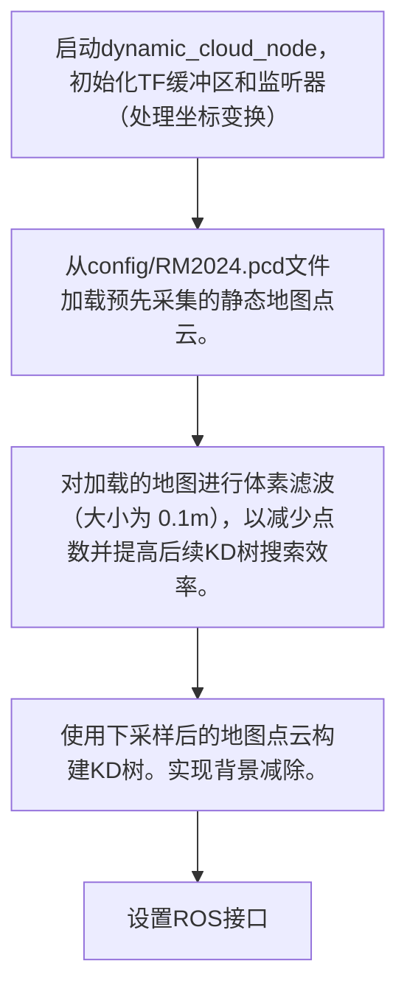
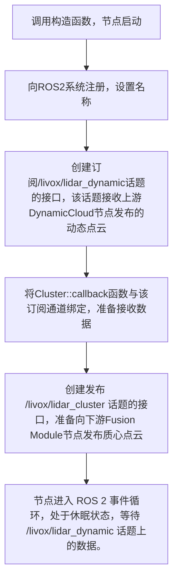

# TDT雷达模块理解
## what & why
雷达模块是雷达站上运行的算法系统，拥有固定的、较高的视角，可为战队提供全图的透视效果，获取实时、可靠的敌方机器人位置、身份和运动轨迹信息，从而辅助战术决策和精准打击 。
## 实战流程
由3个步骤组成：上游DynamicCloud；中游lidar；下游
### lidar：实现了将动态点云转换为质心目标的聚类过程
#### 名词理解
+ 点云：它由激光雷达（LiDAR）传感器发射激光束，测量激光触及物体后返回的时间和角度，从而计算出每个点的三维坐标 $(x, y, z)$。每个点都代表传感器视野范围内物体表面的一个采样点。
+ 质心：提取质心是将复杂的点云数据简化和抽象，用一个单一的、稳定的点来代表目标的位置。（也方便后续的滤波）
~~看到这我其实有个问题：点云中应该包含了很多物体，如何区分不同物体，并分别提取出质心？由此引入了聚类↓~~
+ 聚类：将属于同一个物理物体的点云划分到一个数据组中。TDT采用的是欧几里得聚类（适用于形状规则且分离度高（有明显间距）的目标定位。且在赛场上物体数量动态变化，因此不适用需要预设目标数量的算法。

#### dynamic_cloud
+ 初始化与预处理
DynamicCloud节点的主要是接收原始LiDAR数据，通过坐标变换、过滤静态障碍物和进行背景减除，最终输出干净、累积的动态目标点云。



#### Cluster
+ Cluster::Cluster()节点配置
此阶段在节点启动时只执行一次，完成ROS2节点的配置。

+ Cluster::callback 运行与数据处理
此阶段在每次收到新数据时自动触发。
```mermaid
graph TD
    A[/livox/lidar_dynamic话题收到新的动态点云消息。] --> B[Cluster::callback函数被ROS2自动执行。]
    B --> C[函数内部执行PCL库的欧几里得聚类算法，将输入的点云数据分割成多个独立的簇。]
    C --> D[遍历每个有效的点簇，计算其几何中心（质心）坐标。]
    D --> E[将质心点云消息发布到/livox/lidar_cluster话题。]
    E --> F[等待 /livox/lidar_dynamic 话题上的数据。]
    F --> G[回调函数执行完毕，节点返回等待状态，继续监听下一个输入数据包。]
```